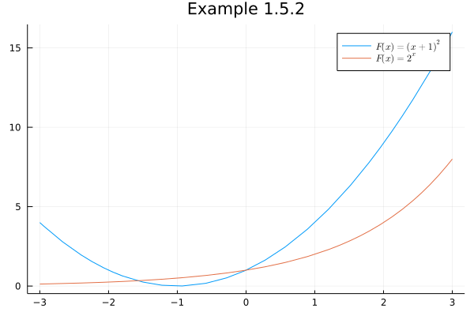
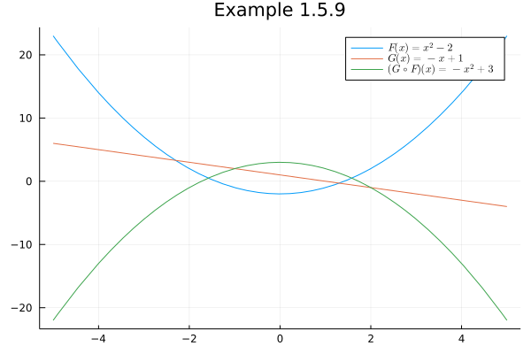
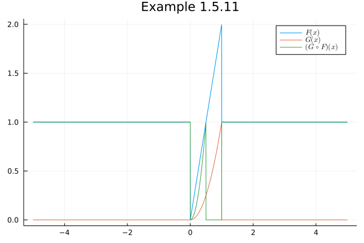

# Set Theory

## Sets, Unions, and Intersections

### Example: Refer to Definition 1.2.1

Let $A = \{0,1,2,3,4,5,6,7,8,9,10\}$ and $B = \{0,2,4,6,8,10\}$. 

Find $A \cup B, A \cap B$, and $A\setminus B$.


```julia
A = Set(range(0, 10, step = 1))
```


    Set{Int64} with 11 elements:
      5
      7
      8
      1
      0
      4
      6
      2
      10
      9
      3


```julia
B = Set(range(0, 10, step = 2))
```


    Set{Int64} with 6 elements:
      0
      4
      6
      2
      10
      8


```julia
A == B
```


    false


```julia
∪(A, B) # union(A,B) 
```


    Set{Int64} with 11 elements:
      5
      7
      8
      1
      0
      4
      6
      2
      10
      9
      3


```julia
∩(A, B) # intersect(A, B)
```


    Set{Int64} with 6 elements:
      0
      4
      6
      2
      10
      8


```julia
setdiff(A, B)
```


    Set{Int64} with 5 elements:
      5
      7
      1
      9
      3


## Functions


```julia
using Pkg
Pkg.add(["LibGEOS", "Plots", "LaTeXStrings"])
```

        Updating registry at `~/.julia/registries/General`
        Updating registry at `~/.julia/registries/JuliaComputingRegistry`
       Resolving package versions...
        Updating `~/.julia/environments/v1.6/Project.toml`
      [b964fa9f] + LaTeXStrings v1.2.1
      [a90b1aa1] + LibGEOS v0.6.7
        Updating `~/.julia/environments/v1.6/Manifest.toml`
      [fa961155] + CEnum v0.4.1
      [cf35fbd7] + GeoInterface v0.5.5
      [a90b1aa1] + LibGEOS v0.6.7
      [d604d12d] + GEOS_jll v3.9.0+0
    Precompiling project...
      ✓ PDMats
      ✓ UnPack
      ✓ ReadOnlyArrays
      ✓ ExprTools
      ✓ CodeTracking
      ✓ ShiftedArrays
      ✓ TranscodingStreams
      ✓ Nullables
      ✓ NodeJS
      ✓ SweepOperator
      ✓ GMP_jll
      ✓ DocStringExtensions
      ✓ Calculus
      ✓ GenericLinearAlgebra
      ✓ ConstructionBase
      ✓ CommonSolve
      ✓ StructTypes
      ✓ Combinatorics
      ✓ Quadmath
      ✓ ProtoBuf
      ✓ URIParser
      ✓ ZipFile
      ✓ SentinelArrays
      ✓ FillArrays
      ✓ FilePathsBase
      ✓ CommonSubexpressions
      ✓ ChainRulesCore
      ✓ DataValues
      ✓ BinaryProvider
      ✓ Media
      ✓ WeakRefStrings
      ✓ OpenSpecFun_jll
      ✓ MemPool
      ✓ Rmath_jll
      ✓ BenchmarkTools
      ✓ QuadGK
      ✓ ReadStat_jll
      ✓ Parameters
      ✓ FileIO
      ✓ EzXML
      ✓ Mocking
      ✓ Glib_jll
      ✓ CodecZstd
      ✓ CodecZlib
      ✓ CodecBzip2
      ✓ MPFR_jll
      ✓ LogExpFunctions
      ✓ MutableArithmetics
      ✓ Setfield
      ✓ CategoricalArrays
      ✓ JSONSchema
      ✓ JuliaInterpreter
      ✓ Roots
      ✓ FilePaths
      ✓ TableShowUtils
      ✓ Snappy
      ✓ TableTraitsUtils
      ✓ StaticArrays
      ✓ Thrift
      ✓ ReadStat
      ✓ Rmath
      ✓ Juno
      ✓ FlatBuffers
      ✓ PyCall
      ✓ FixedEffects
      ✓ XLSX
      ✓ MPC_jll
      ✓ Cairo_jll
      ✓ Qt5Base_jll
      ✓ Electron
      ✓ Arrow
      ✓ TimeZones
      ✓ IterableTables
      ✓ QueryOperators
      ✓ DataTables
      ✓ DiffResults
      ✓ StructArrays
      ✓ Vega
      ✓ LoweredCodeUtils
      ✓ SpecialFunctions
      ✓ Parquet
      ✓ CSV
      ✓ Contour
      ✓ SymEngine_jll
      ✓ GR_jll
      ✓ StatFiles
      ✓ Intervals
      ✓ Vcov
      ✓ FeatherLib
      ✓ ExcelReaders
      ✓ Query
      ✓ DiffRules
      ✓ ParquetFiles
      ✓ RData
      ✓ StatsFuns
      ✓ WooldridgeDatasets
      ✓ VegaLite
      ✓ SymEngine
      ✓ FeatherFiles
      ✓ ColorSchemes
      ✓ GR
      ✓ Polynomials
      ✓ SymPy
      ✓ Revise
      ✓ RDatasets
      ✓ GeometryBasics
      ✓ StatsModels
      ✓ ExcelFiles
      ✓ DataVoyager
      ✓ ForwardDiff
      ✓ Distributions
      ✓ DoubleFloats
      ✓ GLM
      ✓ HypothesisTests
      ✓ FixedEffectModels
      ✓ CovarianceMatrices
      ✓ PlotUtils
      ✓ TextParse
      ✓ RegressionTables
      ✓ VegaDatasets
      ✓ CSVFiles
      ✓ RecipesPipeline
      ✓ PlotThemes
      ✓ Queryverse
      ✓ MathOptInterface
      ✓ Plots
      ✓ JuMP
      127 dependencies successfully precompiled in 87 seconds (123 already precompiled)


```julia
using LibGEOS, Plots, LaTeXStrings
```

### Example 1.5.2

Find the domain and range of following functions.

- For all $x$ in $[-3,3)$,
 \begin{align}
        F(x) = (x+1)^2.
 \end{align}

- For all $x$ in $\mathbb{R}$, 
 \begin{align}
        F(x) = 2^x.
 \end{align}


```julia
Eg1_5_2_F1(x) = (x+1)^2
```


    Eg1_5_2_F1 (generic function with 1 method)


```julia
Eg1_5_2_F2(x) = 2^x
```


    Eg1_5_2_F2 (generic function with 1 method)


```julia
plot([Eg1_5_2_F1, Eg1_5_2_F2], -3, 3, 
	title = "Example 1.5.2", 
	label = [L"F(x) = (x+1)^2" L"F(x) = 2^x"])
```


    

    


### Example 1.5.9

Consider 
\begin{align}
       F(x) & = x^2 - 2, \quad x\in \mathbb{R} \\
       G(x) & = -x + 1, \quad x\in \mathbb{R}.  
\end{align}

- Check whether each of the two functions is a one-to-one functions.

- Verify that $\mathfrak{R}(F) \subseteq \mathfrak{D}(G)$, and find the domain and range of $(G\circ F)(x)$.


```julia
Eg1_5_9_F(x) = x^2 - 2
```


    Eg1_5_9_F (generic function with 1 method)


```julia
Eg1_5_9_G(x) = -x + 1
```


    Eg1_5_9_G (generic function with 1 method)


```julia
plot([Eg1_5_9_F, Eg1_5_9_G, Eg1_5_9_G ∘ Eg1_5_9_F], -5, 5,
	title = "Example 1.5.9",
	label = [L"F(x) = x^2 - 2" L"G(x) = -x + 1" L"(G \circ F)(x) = -x^2 + 3"])
```


    

    


### Example 1.5.11

The following functions $F$ and $G$ are defined for all real $x$ by the equations given. In each case where the composite function $G\circ F$ can be formed, give the domain of $G\circ F$ and a formula for $(G\circ F)(x)$.

 \begin{align}
        F(x) & = 
        \left\{\begin{array}{ll}
        2x, & 0\leq x\leq 1 \\
        1, & \mbox{otherwise},
        \end{array}\right. \\
        G(x) & = 
        \left\{\begin{array}{ll}
        x^2, & 0\leq x\leq 1 \\
        0, & \mbox{otherwise}.
        \end{array}\right.        
 \end{align} 


```julia
function Eg1_5_11_F(x)
           if x <= 1 && x >= 0
               return 2*x
           else
               return 1
           end
       end
```


    Eg1_5_11_F (generic function with 1 method)


```julia
function Eg1_5_11_G(x)
           if x <= 1 && x >= 0
               return x^2
           else
               return 0
           end
       end
```


    Eg1_5_11_G (generic function with 1 method)


```julia
plot([Eg1_5_11_F, Eg1_5_11_G, Eg1_5_11_G ∘ Eg1_5_11_F], -5, 5,
	title = "Example 1.5.11", 
	label = [L"F(x)" L"G(x)" L"(G \circ F)(x)"])
```


    

    


